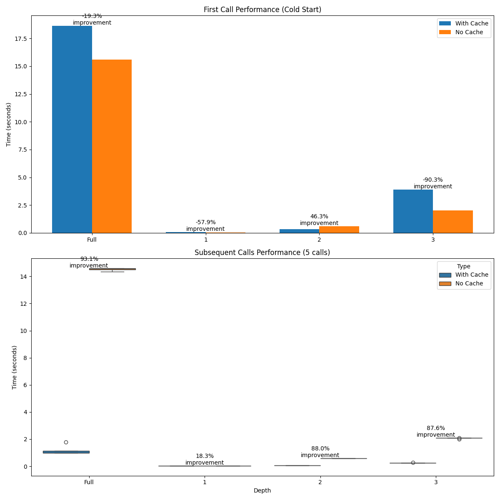

# Cache Benchmark Results

Below are benchmark results between cache vs. no cache for some methods in implemented strategies.

## Average `render_tree` calls over 5 runs

### Detailed Statistics

| Depth     | Cache Status     | Mean      | Std Dev   | Performance Improvement |
|-----------|------------------|-----------|-----------|--------------------------|
| None      | With Cache       | 22.731s   | 0.358s    | 22.3%                    |
| None      | Without Cache    | 29.253s   | 0.507s    |                          |
| 1         | With Cache       | 0.064s    | 0.005s    | 2.0%                     |
| 1         | Without Cache    | 0.065s    | 0.006s    |                          |
| 2         | With Cache       | 0.371s    | 0.014s    | 65.3%                    |
| 2         | Without Cache    | 1.067s    | 0.009s    |                          |
| 3         | With Cache       | 4.658s    | 0.129s    | 16.4%                    |
| 3         | Without Cache    | 5.574s    | 0.173s    |                          |

### Plot

## Compare warmup call vs. subsequent calls, 5 runs

### Detailed Statistics for full depth

| Calls             | Cache Status  | Time     | Std Dev | Improvement           |
|-------------------|---------------|----------|---------|------------------------|
| First Call        | With Cache    | 24.378s  | -       | 16.1%                 |
|                   | Without Cache | 29.047s  | -       |                        |
| Subsequent Calls  | With Cache    | 14.697s  | 0.317s  | 50.6% (Average)       |
|                   | Without Cache | 29.752s  | 0.495s  |                        |

### Plot for all depths

## Compare warmup call vs. subsequent calls, 5 runs with tags cache enabled

### Detailed Statistics for full depth with tags cache

| Calls             | Cache Status  | Time     | Std Dev | Improvement            |
|-------------------|---------------|----------|---------|------------------------|
| First Call        | With Cache    | 18.624s  | -       | -19.3%                 |
|                   | Without Cache | 15.607s  | -       |                        |
| Subsequent Calls  | With Cache    | 1.182s   | 0.342s  | 91.9% (Average)        |
|                   | Without Cache | 14.521s  | 0.102s  |                        |

### Plot for all depths with tags cache

